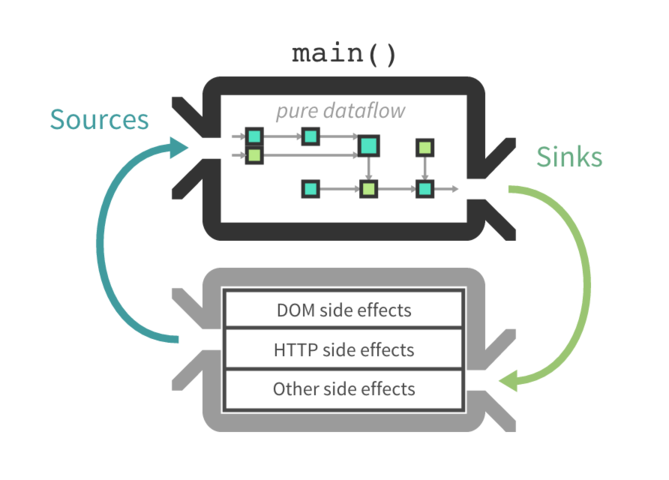
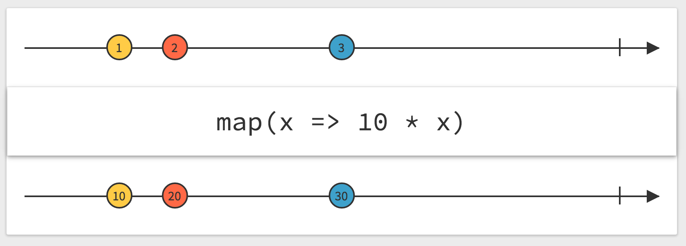
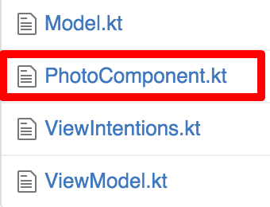
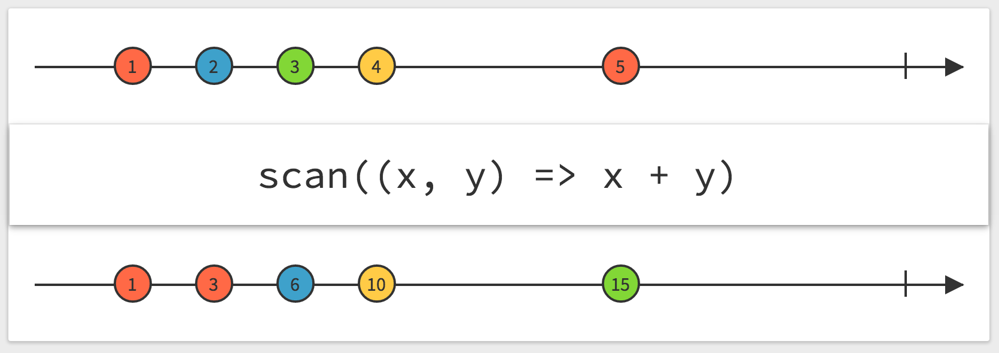

## Borrowing the best of the web to make native better
Brandon Kase & Christina Lee

!!!

## Why are we here?

Let me tell you a story!

* <!-- .element: class="fragment" data-fragment-index="1" --> about a button <!-- .element: class="fragment" data-fragment-index="1" -->
* <!-- .element: class="fragment" data-fragment-index="2" --> a complicated button <!-- .element: class="fragment" data-fragment-index="2" -->

Note: christina

!!!

## Take 1:

* <!-- .element: class="fragment" data-fragment-index="1" --> boss asks for friend button <!-- .element: class="fragment" data-fragment-index="1" -->
* <!-- .element: class="fragment" data-fragment-index="2" --> we say, 'OK! We'll do it this week!' <!-- .element: class="fragment" data-fragment-index="2" -->
* <!-- .element: class="fragment" data-fragment-index="3" --> we do not finish it in a week <!-- .element: class="fragment" data-fragment-index="3" -->
* <!-- .element: class="fragment" data-fragment-index="4" --> _woah...this is very complicated!_ <!-- .element: class="fragment" data-fragment-index="4" --> 
* <!-- .element: class="fragment" data-fragment-index="5" --> boss is less than thrilled <!-- .element: class="fragment" data-fragment-index="5" -->

Note: christina

!!!

## Take 2:

* <!-- .element: class="fragment" data-fragment-index="1" --> boss asks for friend button <!-- .element: class="fragment" data-fragment-index="1" -->
* <!-- .element: class="fragment" data-fragment-index="2" --> we say, 'OK! We'll do it this week!' <!-- .element: class="fragment" data-fragment-index="2" -->
* <!-- .element: class="fragment" data-fragment-index="3" --> we modify our approach <!-- .element: class="fragment" data-fragment-index="3" -->
* <!-- .element: class="fragment" data-fragment-index="4" --> we do not finish it in a week <!-- .element: class="fragment" data-fragment-index="4" -->
* <!-- .element: class="fragment" data-fragment-index="5" --> we finish it in a day! <!-- .element: class="fragment" data-fragment-index="5" -->
* <!-- .element: class="fragment" data-fragment-index="6" --> boss is thrilled <!-- .element: class="fragment" data-fragment-index="6" -->
* <!-- .element: class="fragment" data-fragment-index="7" --> Brandon and Christina still have jobs, hurray! <!-- .element: class="fragment" data-fragment-index="7" -->

Note: christina -- "Today we're here to tell you how and why that transformation took place, how we went from miserable and buggy to joyful and clean by looking in unexpected places. So with that, let's dive in."

!!!

## What went wrong

* Fetch data before view transitions
* Optimistically update components
* Send server requests and react to responses

Note: bkase -- why hard? there are hidden complexities. The button updates immediately, if the network comes back with a different result, we have to deal with that. These types of complexities are under the umbrella of side-effects.

!!!

## Side Effects

* Touch global state, make network requests
* Side-effects are bad, but necessary

Note: bkase -- not going to define it formally, touch the world outside of your local function, necessary, deal with side-effects in principled way helps complexity; one of the tenants of functional programming

!!!

## Most Common Pitfalls

* Mutability 
* Asynchronicity

Note: christina

!!!

> As developers, we are expected to handle optimistic updates, server- side rendering, fetching data before performing route transitions, and so on...
> This complexity is difficult to handle as we’re mixing two concepts that are very hard for the human mind to reason about: mutation and asynchronicity. I call them Mentos and Coke”
> - Motivation | Redux 

Note: christina

!!!


Note: christina

!!!

## Luckily, we are not alone


Note: bkase -- don't worry

!!!

## Web Allies

* The web faces all of these challenges and more
* Unlike native; however, it's iteration rate is fast
* Not "one" UI framework


Note: bkase -- a lot of smart people; exponential curve of ui framework innovation

!!!

### So what did the web come up with?

Note: bkase -- let's go into it

!!!

## Ways to manage side-effects

* View

* State
Note: bkase

!!!

## Ways to manage side-effects

* Separation of concerns
* Mutability and asynchronicity are decoupled

Note: bkase

!!!


Note: christina

!!!

## Flux


Note: christina

!!!

## Redux

```javascript
// The current application state (list of todos and chosen filter)
let previousState = {
  visibleTodoFilter: 'SHOW_ALL',
  todos: [ {
      text: 'Read the docs.',
      complete: false
  } ]
}

// The action being performed (adding a todo)
let action = {
  type: 'ADD_TODO',
  text: 'Understand the flow.'
}

// Your reducer returns the next application state
let nextState = todoApp(previousState, action)
```
-- Dan Abaramov's Data Flow example in Redux

Note: christina -- Reducers!

!!!

## Cycle.js



Note: bkase -- Your application logic is just a dataflow graph

!!!


## Cycle.js

* inputs = read effects you care about
* outputs = write effects you want performed
* <!-- .element: class="fragment" data-fragment-index="1" --> _all application logic is pure!_ <!-- .element: class="fragment" data-fragment-index="1" -->

Note: bkase

!!!

## Cycle.js


> from cycle.js.org

Note: bkase

!!!

## Common Traits

* Unidirectional and circular data flows
* Separation of concerns

Note: christina

!!!

### How do we benefit on Android?

Note: christina

!!!

* Logic is made easy 
  - Implicit data flow of your app becomes explicit.
  - Immutable views of a mutable world
* Debugging is made easy <!-- .element: class="fragment" data-fragment-index="1" -->
  - All edge cases caught at compile-time. <!-- .element: class="fragment" data-fragment-index="1" -->
  - Single source of truth. <!-- .element: class="fragment" data-fragment-index="1" -->
  - Time Travel <!-- .element: class="fragment" data-fragment-index="1" -->

Note: christina

!!!

## How can you adopt this

* View:
  * React native 
  * Anvil

* State: <!-- .element: class="fragment" data-fragment-index="1" -->
  * Direct port of Redux/Cycle/etc. <!-- .element: class="fragment" data-fragment-index="1" -->

Note: christina

!!!

## We focused on State

* Don't have to fight Android's UI framework
* Easy to introduce

Note: bkase

!!!


Note: bkase

!!!

* Native (kotlin)
* Single-Atom-State (like redux) <!-- .element: class="fragment" data-fragment-index="1" -->
* Pure Functional Reactive (like cycle) <!-- .element: class="fragment" data-fragment-index="2" -->
* Composable (like cycle) <!-- .element: class="fragment" data-fragment-index="3" -->

Note: bkase -- native

!!!

## Aside: RxJava

!!!

## Aside: RxJava

> Reactive programming is programming with asynchronous data streams
- Andre Staltz

Global event emitter << Event buses << Data stream <!-- .element: class="fragment" data-fragment-index="1" -->

Note: christina / bkase (jump in for that)

!!!

## Aside: RxJava

When we say streams, we mean **push**-based event streams, not pull-based infinite list streams

Note: christina -- pull-based streams from your CS education

!!!

## Aside: RxJava

What can this look like in practice?

* Streams of button taps
* Streams of snapshots of changing data
* Streams from network responses

Note: christina

!!!

## Aside: RxJava

* RxJava 
  - Reactive programming with streams
  - Tools to combine and transform those streams

Note: christina

!!!

## Aside: RxJava


> from RxMarbles

Note: christina

!!!

## Aside: RxJava


> from RxMarbles

Note: christina

!!!

## Aside: RxJava

`Observable.just(1,2,3)`

!!!

## Example

Note: bkase -- there are many ways, we'll show you one of them

!!!

## Example

<video width="200" controls>
  <source src="img/celltouches.mp4" type="video/mp4">
</video>

<video width="200" controls>
  <source src="img/scrolling.mp4" type="video/mp4">
</video>

Not just a counter

Note: bkase

!!!


!!!


Note: christina

!!!

## 1. View-Model State

```kotlin
data class /*View-Model*/ State(
    val numLikes: Int,
    val numComments: Int,
    val showNewHighlight: Boolean,
    val imgUrl: String?,
    val showUndo: Boolean
)
```

Note: christina

!!!


Note: bkase

!!!

## 2. View Intentions

```kotlin
// Mode is either tapped or untapped
data class ViewIntentions(
    val photos: Observable<Photo>,
    val modes: Observable<Mode.Sum>,
    val globalReadTs: Observable<Long>
)
```

Note: bkase -- photos = a snapshot of the current state of a photo; photos comes from network + push notifs + current user liking a photo optimistic updates; globalReadTs = the last time we tapped on any photo

!!!


Note: christina

!!!

## 3. Model State

```kotlin
// Mode is either tapped or untapped
data class /*Model*/ State(
  val photo: Photo?,
  val isNew: Boolean,
  val mode: Mode.Sum,
): RamState<...>

val initialState = State(
  photo = null,
  isNew = false,
  mode = Mode.untapped
)
```

Note: christina

!!!

### 4. View Intentions => Model State Changes

State changes? We want functional code. We want immutability.

Think of a state change as a function <!-- .element: class="fragment" data-fragment-index="1" -->

`func change(currentState: State) -> State /* nextState */` <!-- .element: class="fragment" data-fragment-index="1" -->

Note: bkase

!!!

### 4. View Intentions => Model State Changes

```kotlin
val model: (ViewIntentions) -> Observable<(State) -> State> = 
  { intentions ->
    val modeChanges: Observable<(State) -> State> =
      intentions.modes.map{ /*...*/ }

    val photoChanges: Observable<(State) -> State> =
      intentions.photos.map{ /*...*/ }

    val tsChanges: Observable<(State) -> State> =
      intentions.globalReadTs.map{ /*...*/ }

    Observable.merge(
        modeChanges, photoChanges, tsChanges)
  }
```

Note: bkase

!!!

### 4. View Intentions => Model State Changes

```kotlin
val modeChanges: Observable<(State) -> State> =
  intentions.modes.map{ mode -> 
    { state: State -> State(state.photo, state.isNew, mode) }
  }
```

Note: bkase

!!!


Note: christina

!!!

### 5. Model State => View-Model State

```kotlin
val viewModel: (Observable<Model.State>)->Observable<ViewModel.State> =
  { stateStream ->
    stateStream
        .map{ state ->
          val undoable = state.mode == Mode.tapped
          val likes = state.photo?.like_details ?: emptyList()
          val comments = state.photo?.comments ?: emptyList()
          ViewModel.State(
              numLikes = likes.sumBy { it.multiplier },
              numComments = comments.count,
              showNewHighlight = state.isNew,
              imgUrl = /* ... */,
              showUndo = /*...*/
          )
        }
  }
```

Note: christina -- cover State->State collapse

!!!



Note: bkase

!!!

### 6. View-Model => Mutate the View

```kotlin
class PhotoComponent(
  viewIntentions: ViewIntentions,
  view: PhotoCellView
): StartStopComponent by Component(
    driver = /* ... */,
    model = /* ... */
)
```

Note: bkase

!!!

### 6. View-Model => Mutate the View

```kotlin
driver = ViewDriver<ViewIntentions, ViewModel.State>(
    intention = viewIntentions,
    onViewState = { old, state ->
      if (old?.imgUrl != state.imgUrl) {
        view.setImg(state.imgUrl)
      }
      /* ... */
    }
),
```

Note: bkase

!!!

### 6. View-Model => Mutate the View

```kotlin
model = ViewDriver.makeModel(
    initialState = Model.initialState,
    createState = Model.createState,
    model = Model.model,
    viewModel = ViewModel.viewModel
)
```

Note: bkase

!!!

Stick it in a recycler-view, hook up the side-effects into view intentions
and you're done

Note: christina

!!!


Note: christina

!!!

* ViewIntentions 
  - The inputs to your component
  - The photo, the mode, the tap timestamp <!-- .element: class="fragment" data-fragment-index="1" -->
* Model <!-- .element: class="fragment" data-fragment-index="2" -->
  - Transform the inputs into state changes <!-- .element: class="fragment" data-fragment-index="2" -->
  - Change mode, change isNew, change photo <!-- .element: class="fragment" data-fragment-index="3" -->
* ViewModel <!-- .element: class="fragment" data-fragment-index="4" -->
  - Transform model state to view-model state <!-- .element: class="fragment" data-fragment-index="4" -->
  - Extract photo url, like counts, etc <!-- .element: class="fragment" data-fragment-index="5" -->
* Component <!-- .element: class="fragment" data-fragment-index="6" -->
  - Apply mutations to your view based on your view-model <!-- .element: class="fragment" data-fragment-index="6" -->
  - Use the View-Model to change the underlying Android view <!-- .element: class="fragment" data-fragment-index="7" -->

Note: christina

!!!

## Under the hood

* Enforce viewintentions/model/view-model structure
* RxJava does heavy-lifting
* and a magic scan <!-- .element: class="fragment" data-fragment-index="1" -->

Note: bkase

!!!

## Under the hood



Note: bkase

!!!

### Implementation of Redux in one-line

```
modelStream.scan(initialState, 
  { currentState, transform -> 
    transform(currentState) 
  })
```

 <!-- .element: class="fragment" data-fragment-index="1" -->

Note: bkase

!!!

## Bonus

* Cycle.js-like side-effect drivers 
* Configurable model state persistance within state <!-- .element: class="fragment" data-fragment-index="1" -->
* Auto-start and stop components onPause/onResume <!-- .element: class="fragment" data-fragment-index="2" -->

Note: bkase -- 1. Combine viewdriver with prefdriver; 2. onPause/onResume forget/save, save to disk

!!!

* Just like cycle
  * read effects are inputs
  * write effects are outputs

* Effects are decoupled from business logic

Note: christina

!!!

### What does it look like in production?

Note: christina

!!!

## Results: The Good

It wouldn't compile

Note: christina

!!!

## Results: The Good

When it did compile, it worked!

Note: christina

!!!

## Results: The Good

* Incredibly modular and composable
* LEGO-like plug-and-play

Note: christina

!!!

## Results: The Good

* Easy to test (by hand + by unit test) & debug
* REALLY EASY <!-- .element: class="fragment" data-fragment-index="1" -->
* Mocking inputs is trivial <!-- .element: class="fragment" data-fragment-index="1" -->
* UI component is defined ONLY by it's state <!-- .element: class="fragment" data-fragment-index="1" -->

Note: christina

!!!

## Results: The Good

* Easy to maintain
* Spec change? <!-- .element: class="fragment" data-fragment-index="1" -->
  * (possibly) add an input stream <!-- .element: class="fragment" data-fragment-index="1" -->
  * add another `map` in the model <!-- .element: class="fragment" data-fragment-index="1" -->

Note: christina

!!!

## Results: The Bad

Ramp up necessary

Note: bkase

!!!

## Results: The Bad

Animations are hard

* chase or interpolate underlying state?
* probably additive animations (google it)

Note: bkase

!!!

## Results: The Bad?

Boiler plate

(screenshot of files)

* Always the 4 pieces
* `cyklic` repo has counter example in one file

Note: bkase

!!!

## Results: The Surprising

It's actually not slow

No noticeable perf hit

Note: christina

!!!

## Results: The Conclusion


Note: christina

!!!

## Results: The Conclusion

We have more powerful tools now 

(i.e. Kotlin + Functional programming)

Let's use them <!-- .element: class="fragment" data-fragment-index="1" -->

Question everything <!-- .element: class="fragment" data-fragment-index="2" -->

Note: christina

!!!

## Cyklic

[](https://github.com/bkase/cyklic)

Github: [bkase/cyklic](https://github.com/bkase/cyklic)

Note: bkase

!!!

## Thanks

| Brandon Kase | Christina Lee |
|:-------------|--------------:|
| bkase@highlig.ht | christina@highlig.ht |
| **[@bkase_](https://twitter.com/bkase_)** | **[@runchristinarun](https://twitter.com/runchristinarun)** |
| [bkase.com](http://bkase.com) | |

<br>

Github: [bkase/cyklic](https://github.com/bkase/cyklic)

Note: both

